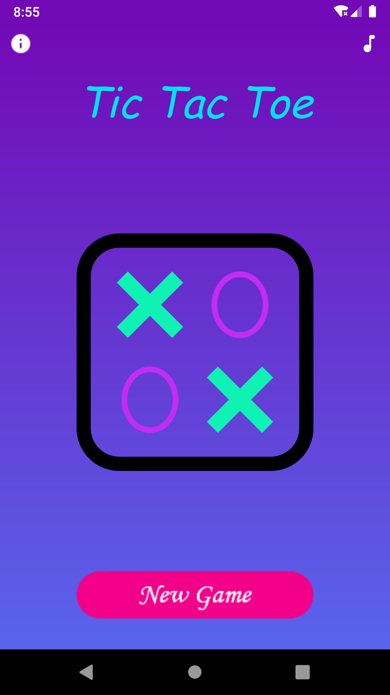
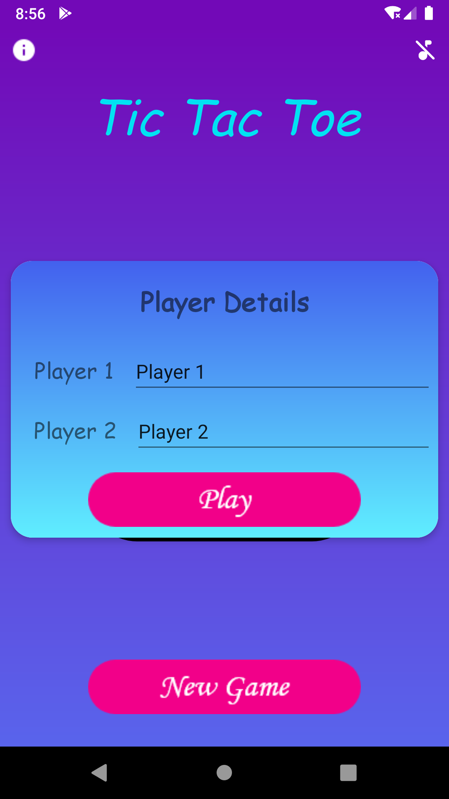
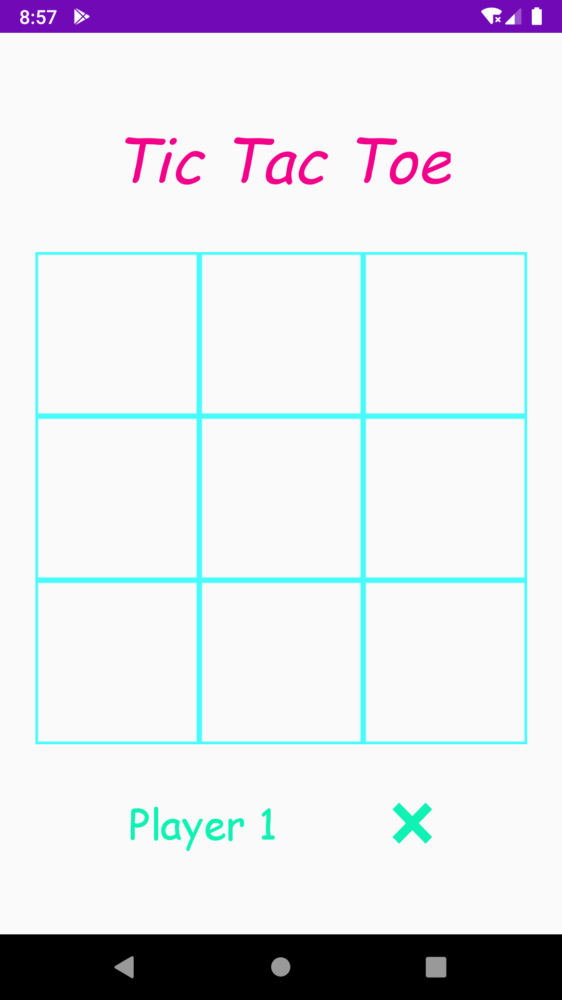
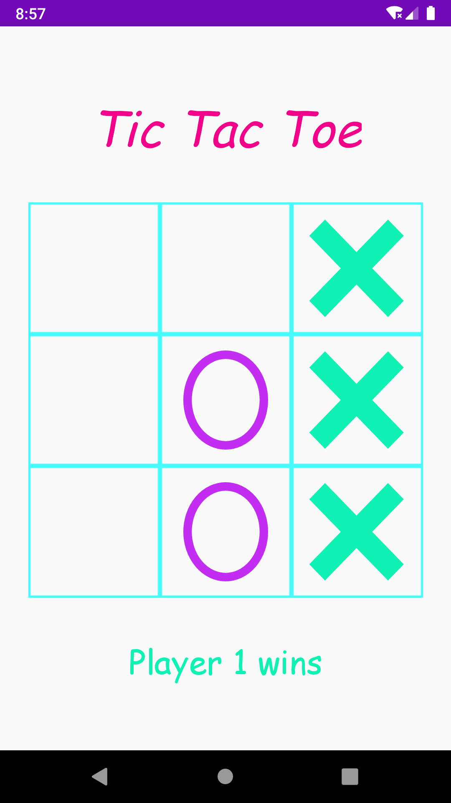
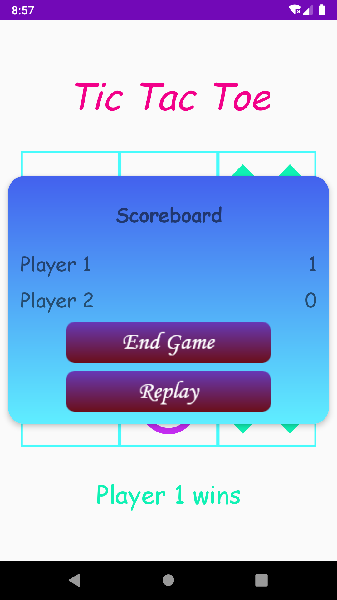
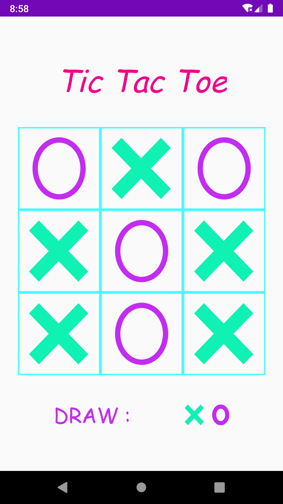

# Tic Tac Toe
Play Tic Tac Toe with this user friendly designed TIC TAC TOE Game.

Tic Tac Toe is free classic puzzle game also known as Noughts and Crosses or sometimes X and O.
The Tic Tac Toe game is a game for two players, who take turns marking the spaces in a 3×3 grid. The player who succeeded in placing three respective marks in a horizontal, vertical, or diagonal row wins the game.
The Tic Tac Toe is a great way to pass your free time whether you\'re standing in a line or spending time with your kids. Stop wasting paper and save trees. Because of the simplicity of Tic Tac Toe, it is often used as a pedagogical tool for teaching the concepts of good sportsmanship and the branch of artificial intelligence.

Start playing Tic Tac Toe game on your Android device.
Get Tic Tac Toe now and let the fun begin!

# Screenshots :

